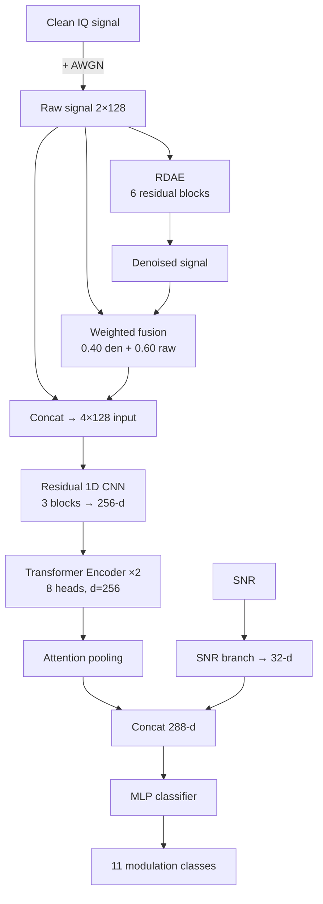

<div align="center">

# 📡 Adaptive RF Modulation Classification

**Residual denoising + raw–denoised signal fusion + Residual CNN–Transformer–Attention**


[Overview](#-overview) · [Architecture](#-architecture) · [Results](#-results) · [Quick Start](#-quick-start) · [Paper](#-publication) · [Citation](#-citation)

</div>

---

## 📌 Overview

Automatic Modulation Classification (AMC) identifies the modulation scheme of an RF signal without prior knowledge. At low SNR, noise destroys the features classifiers rely on, and hard denoising also throws away useful signal.

This project's approach:

1. **Denoise** the signal with a Residual Denoising Autoencoder (RDAE).
2. **Fuse** the denoised signal with the original raw signal, so no information is lost.
3. **Classify** with a Residual 1D CNN → Transformer → Attention network, with a dedicated SNR branch.

### Highlights

| | |
|---|---|
| 🎯 **Accuracy** | **87.20%** on RadioML 2016.10a (SNR ≥ −8 dB) |
| 🧹 **Denoising** | Residual correction: `X_den = X_raw + R(X_raw)` |
| 🔀 **Fusion** | `X_fused = 0.40·X_den + 0.60·X_raw` |
| ⚡ **Speed** | 5.75 ms/frame (~174 frames/s) |
| 🪶 **Size** | ~1.69M trainable parameters |

---

## 🧠 Architecture



<details>
<summary><b>🔬 Component details (click to expand)</b></summary>

### 1. Noise model
$$X_{raw} = X_{clean} + N_{AWGN}$$

### 2. Residual Denoising Autoencoder (RDAE)
The network learns a *correction* instead of reconstructing the signal from scratch:

$$X_{denoised} = X_{raw} + R(X_{raw})$$

Encoder stem → 3 residual encoder blocks → residual bottleneck → upsampling → 2 residual decoder blocks → residual head (6 residual blocks total).

### 3. Raw–denoised fusion
$$X_{fused} = 0.40\,X_{denoised} + 0.60\,X_{raw}$$

The classifier input stacks raw (2×128) and fused (2×128) into a **4×128** tensor.

### 4. Residual 1D CNN

| Block | In → Out | Kernel | Dropout |
|---|---|---:|---:|
| CNN 1 | 4 → 64 | 7 | 0.15 |
| CNN 2 | 64 → 128 | 5 | 0.20 |
| CNN 3 | 128 → 256 | 3 | 0.25 |

Two Conv1D layers per block, 2 max-pooling layers, 256-d output.

### 5. Transformer encoder

| Parameter | Value |
|---|---:|
| Blocks | 2 |
| Embedding dim | 256 |
| Heads (dim/head) | 8 (32) |
| Feed-forward dim | 512 |
| Dropout | 0.25 |

### 6. Attention pooling
`Linear 256→128 → Tanh → Linear 128→1 → Softmax → weighted sum` → 256-d context vector.

### 7. SNR branch and classifier
- SNR: `Linear 1→16 → ReLU → Linear 16→32`
- Fusion: 256 + 32 = **288-d**
- Head: `288 → 256 → 128 → 11` with ReLU and dropout (0.40, 0.30)

</details>

---

## 📊 Dataset

**RadioML 2016.10a** (not included in this repo; download separately).

| Property | Value |
|---|---|
| Samples | 220,000 |
| Classes | 11 modulations |
| Signal length | 128 I/Q samples |
| SNR range | −20 to +18 dB |
| Evaluated on | SNR ≥ −8 dB |

---

## 📈 Results

| Metric | Value |
|---|---:|
| **Accuracy** | **87.20%** |
| Macro Precision / Recall / F1 | 0.89 / 0.87 / 0.87 |
| Weighted F1 | 0.87 |
| Parameters | ~1.69M |
| Inference | 5.75 ms/frame |

### Ablation

| Model | Accuracy |
|---|---:|
| Baseline CNN | 74.10% |
| CNN–BiLSTM–Attention | 81.42% |
| CNN–BiLSTM–Attention + Fusion | 86.63% |
| **Residual CNN–Transformer + Fusion (proposed)** | **87.20%** |

Fusion alone adds **+5.2 points** to the BiLSTM baseline, and the proposed backbone adds a further **+0.6**.

---

## ⚙️ Training Setup

| | |
|---|---|
| Optimizer | AdamW (lr `5e-4`, weight decay `1e-4`) |
| Batch size / epochs | 256 / 50 |
| Scheduler | ReduceLROnPlateau |
| Precision | AMP + GradScaler |
| Hardware | Google Colab, NVIDIA Tesla T4 |
| Stack | PyTorch, NumPy, Pandas, scikit-learn, Matplotlib |

---

## 🚀 Quick Start

```bash
git clone https://github.com/Monish-Ram250/Adaptive-RF-Modulation-Classification.git
cd Adaptive-RF-Modulation-Classification
pip install -r requirements.txt
```

1. Download **RadioML 2016.10a** and set the dataset path in the first cells of `RF_Modulation_Classification.ipynb`.
2. Run the notebook top to bottom.

---

## 📁 Repository Structure

```text
├── RF_Modulation_Classification.ipynb   # full pipeline: data, RDAE, classifier, eval
├── ICCIS_2026_Final_Manuscript_Paper_925.pdf
└── requirements.txt
```

---

## ⚠️ Limitations & Future Work

Evaluation is currently limited to **AWGN** on a single dataset. Not yet covered:

- [ ] Rayleigh / other fading channels
- [ ] Frequency and phase offsets, hardware impairments
- [ ] SDR and over-the-air validation
- [ ] Additional RF datasets
- [ ] Model compression / quantization for edge deployment

---

## 📄 Publication

**Adaptive RF Modulation Classification Using Residual Denoising and Raw–Denoised Signal Fusion with Residual CNN–Transformer–Attention Learning**

| | |
|---|---|
| Conference | ICCIS 2026, 8th International Conference on Communication and Intelligent Systems |
| Venue | BITS Pilani, K K Birla Goa Campus |
| Dates | September 26–27, 2026 |
| Paper ID | 925 |
| Status | ✅ Accepted & presented · ⏳ Proceedings pending |

---

## 📚 Citation

```bibtex
@inproceedings{ram2026adaptive,
  author    = {Akula Monish Ram},
  title     = {Adaptive RF Modulation Classification Using Residual Denoising and
               Raw--Denoised Signal Fusion with Residual CNN--Transformer--Attention Learning},
  booktitle = {Proc. 8th International Conference on Communication and Intelligent Systems (ICCIS)},
  year      = {2026},
  note      = {Paper ID 925}
}
```

---

## 👨‍💻 Author

**Akula Monish Ram**: B.Tech CSE, Lovely Professional University
[GitHub](https://github.com/Monish-Ram250)

## 🙏 Acknowledgement

Thanks to my research mentor and faculty for their guidance, and to the ICCIS 2026 organizers for the opportunity to present.

<div align="center">

⭐ If you find this useful, consider starring the repo.

</div>
